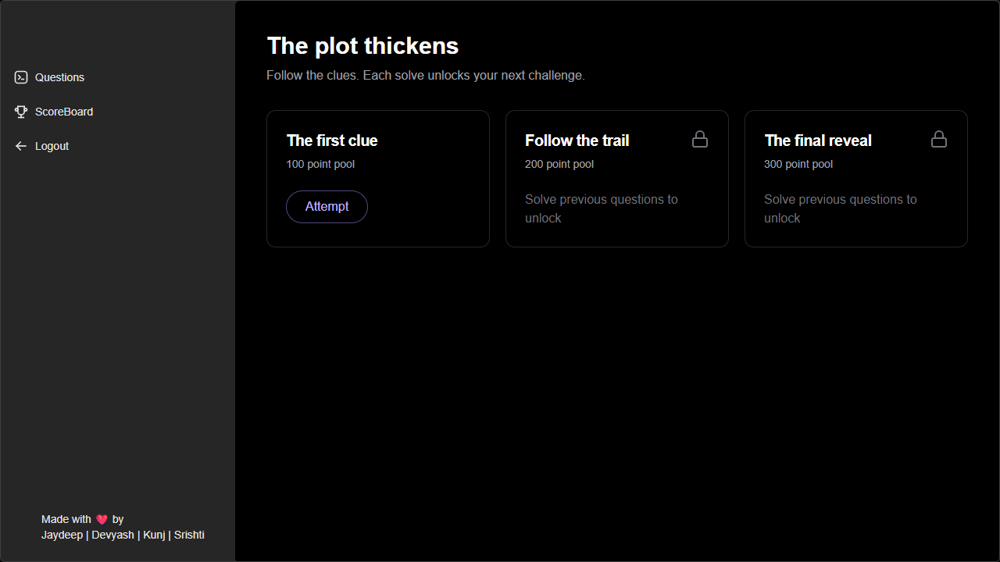
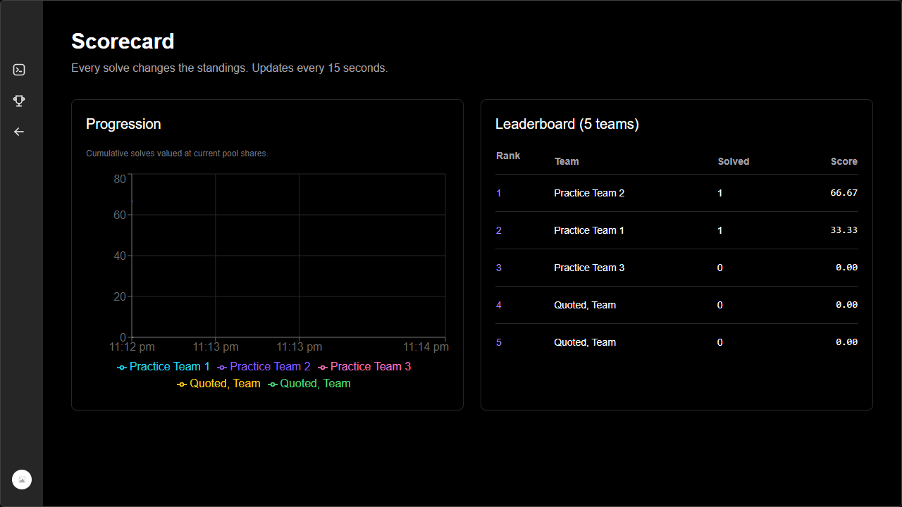

# Hack The Plot

Hack The Plot is a custom CTF hosting platform for TechHunt at IIIT Vadodara. Teams work through challenges, submit flags, and follow their progress on a shared scoreboard.

This repository is a Django adaptation of the original TechHunt application. I kept the original Next.js interface and moved authentication, challenge access, scoring, team registration, and certificate verification into a separate Django backend backed by PostgreSQL.

**[Open the live demo](https://hack-the-plot-iiitv.vercel.app)** and choose **Try the demo**. The free backend may need about a minute to wake up. The login page retries automatically while it starts.

The public deployment is a **portfolio demo**. Its clues and teams are synthetic. It is not an active college competition.

## What you can try

- Enter the portfolio demo as a guest, without sharing your email.
- Work through three practice challenges. Each solve unlocks the next one.
- Watch the leaderboard change as teams solve challenges.
- Play audio clues with synchronized SRT captions when an organizer adds them.
- Organizers can import teams from CSV, manage challenges in Django admin, and issue or revoke certificates after an event.

The original app's dark interface and purple accents remain. Rasputin/device pairing and the later Halloween redesign are outside this version.

## Screenshots





## How scoring works

Each challenge has a point pool. The first solver gets a larger share, but the total points distributed never exceed the pool.

For the kth solver among n teams, the score is:

`pool / (k × (1 + 1/2 + … + 1/n))`

For a 100-point challenge with two solvers, the first team gets about 66.67 points and the second gets 33.33. Earlier scores change when another team solves the same challenge. The chart uses current pool shares, so its final values match the leaderboard.

Scores are calculated on the backend. Database constraints and row locks prevent duplicate solves and conflicting solve positions. Equal scores are ordered by the earliest last solve, then team ID.

## Run locally

You need Docker Desktop with Linux containers:

```sh
git clone https://github.com/drowningFi5h/hackThePlot.git
cd hackThePlot
docker compose up --build -d
docker compose exec backend python manage.py seed_demo
```

Open [the app](http://localhost:3000) and [Django admin](http://localhost:8000/admin/).

Development-only accounts:

| Account | Email | Password |
| --- | --- | --- |
| Team | team1@example.test | Demo-only-password-2026! |
| Organizer | organizer@example.test | Demo-only-password-2026! |

These are synthetic local accounts. `seed_demo` refuses to run with production settings. Never reuse its passwords for your organizer account.

For guest entry locally, set `DEMO_MODE: "1"` in the backend Compose environment and recreate the backend. Its startup command seeds portfolio challenges only if the database has no challenges.

### Work on the code

The frontend lives in `frontend/`; Django lives in `backend/`.

You can run just PostgreSQL through Docker and use Node 22 and Python 3.12 locally:

```sh
docker compose up -d db
cd backend
uv sync --locked
# Set DJANGO_DEBUG=1 and DATABASE_URL from .env.example in your shell.
uv run manage.py migrate
uv run manage.py seed_demo
uv run manage.py runserver 127.0.0.1:8000
```

In a second terminal:

```sh
cd frontend
npm ci
# Copy .env.example to .env.local.
npm run dev
```

Django reads environment variables directly; it does not automatically load a .env file. In PowerShell use `$env:DJANGO_DEBUG='1'`. For local development, DATABASE_URL defaults to the Compose database.

## Organizer workflow

1. Create a private organizer account with `createsuperuser` or the one-time bootstrap variables.
2. Set the event name and start/end times in Django admin. Times display in Asia/Kolkata and are stored in UTC.
3. Add ordered challenges, exact flags, point pools, and HTTPS asset links. Challenge numbers can contain gaps.
4. Upload a CSV containing `username,email` on the Teams page. Validate the preview, then commit the import.
5. Download generated credentials once and distribute them privately. Re-imports do not silently reset passwords.
6. After the event ends, issue certificates from the Teams page. Django admin can revoke them.

Challenge definitions become read-only in admin after the first solve. Staff can preview challenges but do not compete. Asset URLs are external links; they can be shared once disclosed. SRT hosts must allow browser CORS. No uploads are stored on the backend filesystem.

## Security and architecture

- Django sessions use HTTP-only cookies. Mutations require CSRF tokens and allowed origins.
- A restricted Next.js proxy keeps browser API requests on the frontend origin.
- Team passwords use Django's password hasher. Flags use a purpose-separated HMAC hash and constant-time comparison.
- Certificate signatures use a separate secret and stored, revocable records.
- Login and submission limits are shared through PostgreSQL.
- Participant APIs exclude flags, password hashes, and other teams' email addresses.
- Practice guest access exists only when `DEMO_MODE=1`; guests never receive staff access.

Keep the Django secret stable during an event: it also keys flag hashes. Rotating it requires re-entering flags. Keep all deployment secrets outside Git.

## Verification

```sh
cd backend
uv run ruff check .
uv run manage.py test --settings=config.test_settings
uv run manage.py spectacular --file ../docs/openapi.yaml --validate --fail-on-warn
cd ../frontend
npm run api:types
npm run lint
npm run typecheck
npm run build
npm run test:e2e
```

Tests need PostgreSQL and the development environment variables. Browser tests need both servers running and a fresh `seed_demo` database followed by `seed_browser_fixtures`. They exercise desktop/mobile journeys, CSV imports, and proxy protections. GitHub Actions provisions those dependencies.

The [OpenAPI contract](docs/openapi.yaml) generates the TypeScript API types. [Deployment instructions](docs/deployment.md), [backup/restore instructions](docs/operations.md), and [verification results](docs/verification.md) describe the operational details and limits.

## Two-week hosting

The deployment targets Vercel Hobby, Render Free, and Render Free PostgreSQL. The backend can sleep, and the free database expires after 30 days. This is suitable for a short portfolio demonstration, not a promise of production availability. Certificate verification also needs the backend to remain online.

See [the deployment guide](docs/deployment.md) before creating the database. The repository does not include paid services or a keep-alive workaround.

## What I would improve next

For a permanent resume link, the first priority is a database that does not expire. I would also add event archives and challenge versioning, so organizers can run a new hunt without changing old results. The current launch deliberately uses a fresh database and fixed challenge definitions after the first solve.

## Where this version started

The frontend comes from [SteakFisher/hacktheplot](https://github.com/SteakFisher/hacktheplot), by the original TechHunt team, including [SteakFisher](https://github.com/SteakFisher) and [TheDevyashSaini](https://github.com/TheDevyashSaini). The UI also credits Jaydeep, Devyash, Kunj, and Srishti.

This adaptation starts at [d518d0e82339](https://github.com/SteakFisher/hacktheplot/commit/d518d0e82339a3ce1552379f0301bbc446d7c56a), the 69th commit counting from the start of the upstream history inspected for this migration. Original authors and timestamps are preserved. Django migration commits use their actual implementation dates.

The original repository did not include a license file at that revision; this adaptation does not invent a license for upstream work.
